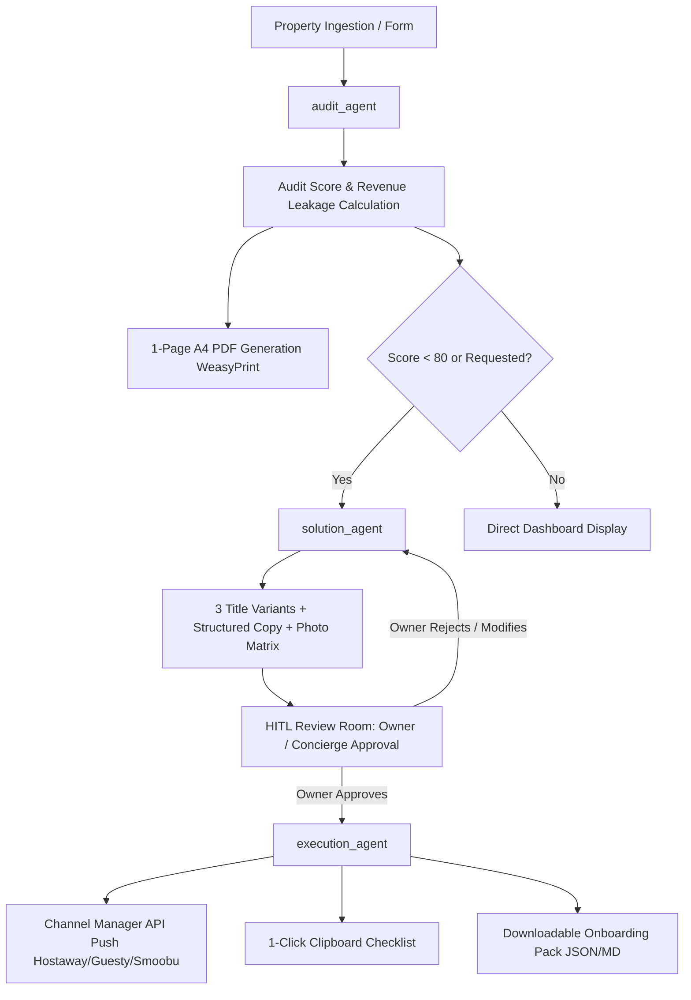

# Concierge Audit OS — Technical Plan & Architecture Blueprint

## Overview
**Concierge Audit OS** is an agentic AI operating system designed for short-term rental (STR) management companies and revenue optimization agencies. It unifies quantitative revenue auditing, algorithmic OTA copywriting, and automated channel manager execution into a deterministic 3-agent pipeline with Human-in-the-Loop (HITL) approval.

---

## Architecture Pipeline

